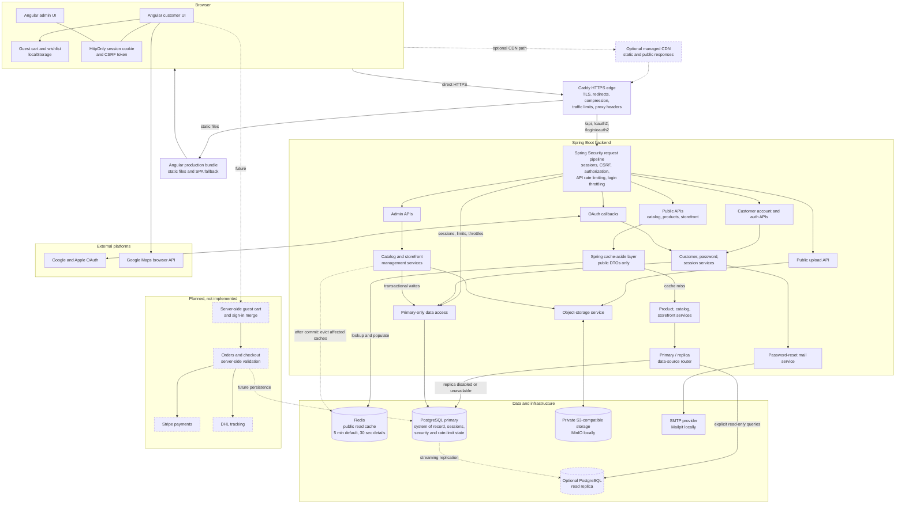

# Architecture

Built by Grain will use a simple monorepo structure with separate frontend and backend applications.

## Applications

- `apps/frontend`: Angular customer and admin user interfaces.
- `apps/backend`: Spring Boot REST API for products, orders, customers, and admin workflows.

## Supporting Areas

- `docs`: Architecture, roadmap, API notes, and coding rules.
- `infra`: Podman, database, and deployment configuration.
- `scripts`: Developer automation such as setup, linting, or local checks.

## System Architecture Diagram

Solid arrows show synchronous current runtime paths. Dashed arrows show
asynchronous, optional, or future paths; dashed boxes are optional or planned.

## Production request edge

Production uses a same-origin HTTPS edge in front of both applications.

The edge owns HTTPS, HTTP-to-HTTPS redirects, static compression and caching,
broad per-client traffic limits, forwarding-header sanitation, and API routing.
Spring Boot remains authoritative for authentication and applies shared
PostgreSQL rate limits using account, client-address, reset-token, and
authenticated-principal scopes. A managed CDN may cache only the explicitly
public responses; account, admin, OAuth, and other personalized responses must
not be cached.

## Public read performance

The backend uses cache-aside Redis caching for the public product list, product
details, category/navigation responses, category pages, and the public storefront
aggregate.

The normal public TTL is five minutes. Product details expire after 30 seconds
because they include display stock and price data. Successful product, catalog,
variant, image, and storefront mutations clear all related public caches after the
database transaction completes. Cache read/write failures are logged and fall back
to PostgreSQL, so Redis is not a source of truth or a request-availability
dependency.

Only explicitly marked public, read-only service methods may use the optional
PostgreSQL replica. The router also verifies that the active transaction is
read-only, and replica pool connections are configured as read-only. Writes,
Flyway, authentication, customer accounts, sessions, throttling, password resets,
and admin reads always use the primary. The replica is optional and disabled by
default. If acquiring a replica connection fails, that read falls back to the
primary; failures after a query has started are returned normally and are not
automatically retried.

Redis and the replica can return bounded, eventually consistent storefront data.
Checkout and future order creation must re-read price, stock, customer, and payment
state from the primary inside the write transaction; cached display data must never
authorize a purchase. Production monitoring should alert on replication lag and
Redis error/fallback logs.

## Initial Backend Direction

The backend should expose REST APIs and keep business logic separate from controllers.

Future areas:

- Product catalog
- Shopping cart
- Orders
- Admin management
- Stripe payments
- DHL tracking

Stripe and DHL are intentionally out of scope for the initial setup.

## Initial Frontend Direction

The frontend should be an Angular application with clear feature areas.

Future areas:

- Product listing
- Product detail pages
- Cart
- Checkout
- Admin dashboard

Checkout can be designed later, after product and order basics exist.

## Catalog And Guest Cart

The public Angular catalog uses standalone components for the product list, product detail, shop navigation, and cart page. Public product API calls remain in `ProductService`; guest-cart state and quantity rules remain in `CartService` so components only coordinate presentation and user actions.

The current guest cart is browser-local and persists display data in `localStorage`.
This is a temporary Stage 1 limitation, not the target architecture. Its subtotal is
explicitly an estimate and cached prices are never trusted for payment or an order.
Stage 2 must move the canonical guest cart to the server, identify it with an opaque
secure cookie, expire it after 30 days of inactivity by default, and define a tested
anonymous-to-customer merge rule.

Public product detail lookup uses the existing product service and `findBySlugAndActiveTrue`, keeping the controller thin and preventing inactive products from being exposed.

## Customer Accounts

Customer authentication uses Spring Security's delegating password encoder,
JDBC-backed server sessions, CSRF protection, and HttpOnly cookies. Customer data,
saved addresses, and hashed password-reset tokens are stored in PostgreSQL through
JPA and Flyway. All account resources are resolved from the authenticated principal.

See [customer-accounts.md](customer-accounts.md) for the security model, local mail
setup, environment variables, and checkout integration contract.
